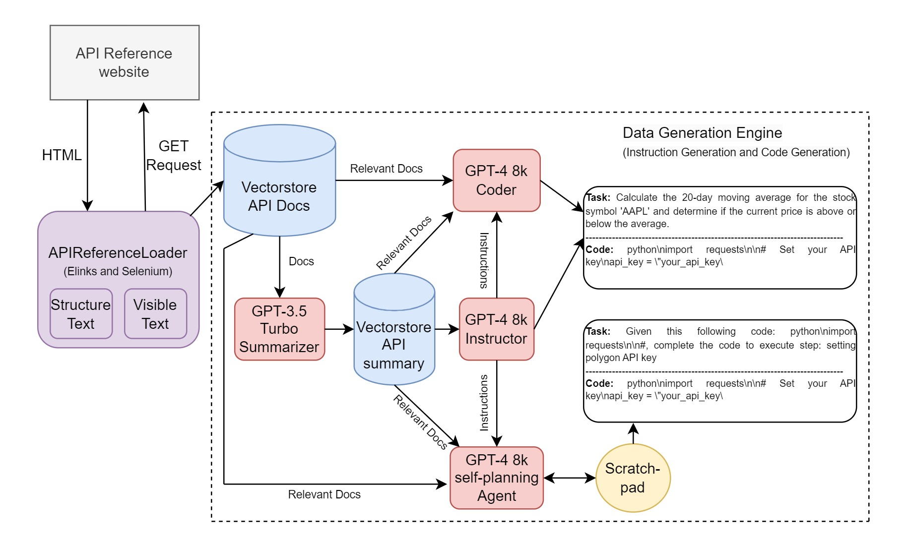

# LlamaAcademy: Teaching Llamas How to Code
### Teach GPTs to read API documentation using LLaMA, LoRA, and Langchain.
Wouldn't it be great if GPTs could learn about new APIs? With LlamaAcademy you can teach GPTs to call Stripe, Notion, or even your own product's API. Instead of hosting API _documentation_, you can host an API _implementation_! Just point LlamaAcademy at your API docs, run the script, and -- _shazam_! -- a new Llama model will be created for you. You can host that model on your server, and users can call your bespoke mini-GPT to write their API glue.

#### Seriously?
Well, sort of. LlamaAcademy is experimental -- we haven't gotten it to consistently generate great code (yet). We'd love help with that, if you're into that sort of thing.

#### Demo: A Llama That Learned Notion's API
https://user-images.githubusercontent.com/51882888/232329429-c7aadc40-8251-41f3-b4bb-9ac41ac2c6f8.mp4

## How it works
LlamaAcademy is a pipeline that combines the following steps: crawling, data generation using GPT3.5 and GPT4 and fine-tuning Vicuna-13B on synthetic data.

## Installation
You need to install firefox and Elinks, then install all necessary pythonic dependencies. You also need to input an OPENAI_KEY.
```bash
sudo apt-get install firefox elinks
conda env create --file=environment.yaml
conda env config vars set OPENAI_API_KEY=YOUR_API_KEY
```
## Usage
LlamaAcademy uses simple interface by abstracting every user hyper-parameters with configuration file
```yaml
GENERATE: True #Turn off if you don't want to generate the data
API_DOCS: https://developers.notion.com/reference 
DEPTH_CRAWLING: 1 #0 if your API website is long and not hierarchical for example polygon.io. Otherwise, feel free to set, it might take much longer if your webiste has many children.
SUMMARIZE_DOCS: True
MICRO_BATCH_SIZE: 3  
BATCH_SIZE: 12
EPOCHS: 4  
LEARNING_RATE: 3e-4  
WARMUP_STEPS: 5
CUTOFF_LEN: 2048 
LORA_R: 8
LORA_ALPHA: 16
LORA_DROPOUT: 0.05
OPENAI_ENGINE: "gpt-4"
NUM_PROMPT_INSTRUCTIONS: 3
NUM_TASKS_TO_GENERATE: 200 #recommended number of examples
DATA_PATH: "assets/"
OUTPUT_DIR: "output/lora-vicuna-api-notion"
```
To run the fine-tuning process, run
```bash
CUDA_VISIBLE_DEVICES=0 python3 main.py --config configs/vicuna_13b.yaml
```
After the training, run export LoRA model to HuggingFace weights by
```bash
python3 export_hf.py --base_model jeffwan/vicuna-13b --model_folder output/lora-vicuna-api-notion
```
To run inference with LangChain
```bash
python3 inference.py --model_folder output/lora-vicuna-api-notion
```
### Hardware requirements
This code is tested with 1 RTX A6000 instance in vast.ai (approximated 0.6$/1h). The peak VRAM is 27.8 gb, therefore, any GPU with VRAM > 30gb will safe for fine-tuning.
The fine-tuning is done after 20 minutes with 100 examples, the data generation for polygon is completed after 1 hour (most of the time spent in GPT-4 instances generation and crawling process due to screen scraping is quite expensive).

## Plan
- [ ] Implement (IA)^3 for few-shot fine-tuning
- [ ] Implement flash_attention
- [ ] Implement scratch-pad based GPT-4 agent to generate multi-turn planning and generating code

## Code Files
This repository provides the following Folders and Files
- `assets/`: The folder contains seed tasks + training URLs to generate the data (see self-instruct for more information)
    - `data.json`: generated data will be saved here for training
    - `generated_instructions.jsonl`: generated instructions for instruction tuning will be saved here
    - `training_urls.json`: common API for crawling and generating the training data (other direction)
    - `seed_tasks.json`: human written seed tasks for self-instruct process (4-10 examples are recommended)
    - `prompt_summary.txt`: prompt for GPT3.5-turbo extract and summarize the crawled API documents
    - `prompt_input_code.txt`: prompt for GPT4 generate code with references queried from vectorstore
- `configs/`: The folder for the configuration files
- `chain.py`: The file for custom Langchain pipeline and agents
- `data_gen.py`: The file implementing data generation using GPT3.5, GPT4, Bing with different strategies
- `main.py`: The main inteference file for user to customize their Alpaca to API references (scraping API references website, generating instruction-code pairs and fine-tuning Vicuna) 
- `inference.py`: Allow user to inference with a trained model with a query related to the API (using Langchain + LlamaAcademy)
- `environment.yaml`: The file for the dependencies
- `utils.py`: The file for the helper functions
- `memorizing.py`: (Still under construction) Using [memory fine-tuning method](https://arxiv.org/pdf/2203.08913.pdf) to force Vicuna to memorize API references without pre-training
- `ingest_docs.py`: Implementing API references crawling using Elinks and Selenium
